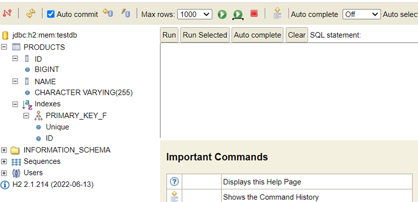

# FirstRestAPI — Product Management (Task 2)

This is a simple REST API for managing products, built using Spring Boot, Java 17, and H2 database.  
It supports full CRUD operations and is documented with Swagger UI.

---

## Technologies Used

- Java 17
- Spring Boot 3.2.4
- Spring Web
- Spring Data JPA
- H2 In-Memory Database
- Lombok
- Springdoc OpenAPI 2.5.0 (Swagger)
- Maven

---

##  How to Run

1. Make sure Java 17 is installed.
2. Clone this repository.
3. Run the application using IntelliJ or:
   ```bash
   mvn spring-boot:run

---
## Screenshot of Result



